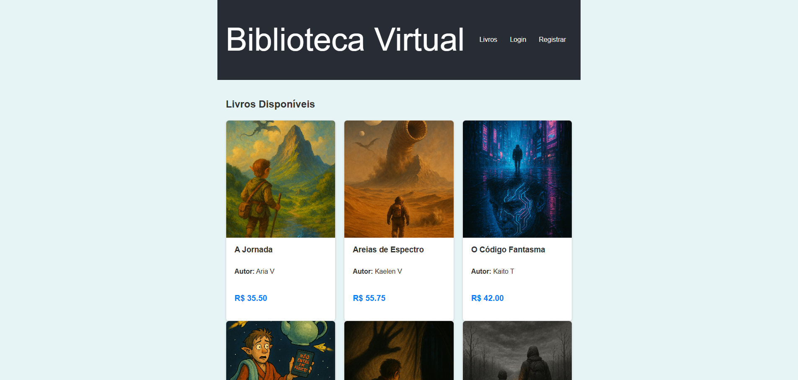

# Biblioteca Virtual - Full Stack (Django + React)

Uma aplicação web completa de uma biblioteca virtual, desenvolvida do zero para demonstrar habilidades full stack com Python/Django no backend e React no frontend.

**[Clique aqui para ver a demonstração ao vivo!](https://biblioteca-virtual-django-react.vercel.app)**  

 
---

### Nota sobre o Deploy

A aplicação está hospedada nos planos gratuitos da **Vercel** (Frontend) e **Render** (Backend). O servidor do backend é "colocado para dormir" após 15 minutos de inatividade. Portanto, **o primeiro carregamento dos livros pode levar de 30 a 60 segundos** enquanto o servidor é reinicializado. Por favor, seja paciente. As requisições seguintes serão rápidas.

---

## Funcionalidades Principais

-   **Autenticação de Usuários:** Sistema completo de registro e login com autenticação por token.
-   **Catálogo de Livros:** Visualização de uma lista de livros com capas, títulos, autores e preços.
-   **Página de Detalhes:** Rota protegida (exige login) para detalhes completos do livro, incluindo resumo.
-   **Sistema de Feedback:** Usuários logados podem adicionar comentários e notas (1 a 5) em cada livro, com atualização em tempo real.
-   **Interface Reativa:** Construída como uma Single Page Application (SPA), com atualizações instantâneas sem recarregar a página.
-   **Design Responsivo:** O layout se adapta a telas de desktop, tablets e celulares.

---

## Tecnologias Utilizadas

-   **Backend:**
    -   Python 3
    -   Django & Django REST Framework
    -   PostgreSQL (em produção)
    -   Gunicorn
-   **Frontend:**
    -   React (com Vite)
    -   React Router
    -   React Context API
    -   React Hot Toast
-   **Deploy & Armazenamento:**
    -   **Render** (para o Backend Django e Banco de Dados)
    -   **Vercel** (para o Frontend React)
    -   **Cloudinary** (para armazenamento e serviço das imagens das capas)

---

## Como Executar o Projeto Localmente

### Pré-requisitos
-   Python (versão 3.12+)
-   Node.js e npm

### Backend
```bash
# 1. Clone o repositório e navegue para a pasta do backend
git clone https://github.com/CaioSouza10/biblioteca-virtual-django-react.git
cd biblioteca-virtual-django-react/backend

# 2. Crie e ative o ambiente virtual
python -m venv venv
# No Windows: venv\Scripts\activate
# No macOS/Linux: source venv/bin/activate

# 3. Instale as dependências
pip install -r requirements.txt

# 4. Execute as migrações e inicie o servidor
python manage.py migrate
python manage.py runserver
```
O backend estará rodando em `http://127.0.0.1:8000`.

### Frontend
```bash
# Em um novo terminal, navegue para a pasta do frontend
cd biblioteca-virtual-django-react/frontend

# 1. Instale as dependências
npm install

# 2. Inicie o servidor de desenvolvimento
npm run dev
```
A aplicação estará acessível em `http://localhost:5173` (ou a porta que o Vite indicar).